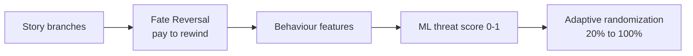

   

**Game design and tools by Pratham Prateek Mohanty**

## 🌸 Blossom Bifurcation Mechanism

Players pay for **regret-free convenience**, never for luck. A story branches at key points, and a player can pay to rewind (**Fate Reversal**) and take a different path. A small trained model watches for players probing the hidden pattern and adapts randomization, so casual players get consistency and probers get chaos.

| What | Where |
|---|---|
| 🎮 Live demo | https://huggingface.co/spaces/writistic-studios/Blossom-Bifurcation-Demo |
| 💻 Code, API, six developer guides | [Blossom-Bifurcation-Threat-Model](https://github.com/Writistic-Studios-LLP/Blossom-Bifurcation-Threat-Model) |
| 🧠 Model | https://huggingface.co/writistic-studios/Blossom-Bifurcation-Threat-Model |
| 📊 Dataset (30,000 simulated sessions) | https://huggingface.co/datasets/writistic-studios/Blossom-Bifurcation-Simulated-Sessions |
| ⚡ Hosted API | https://bbm-threat-api.vercel.app |
| 📄 Research paper V5.0 | https://doi.org/10.5281/zenodo.23180849 |

> Honest status: the model is a prototype trained on simulated players, since no real player logs exist yet. Retrain on real beta data before relying on it.
